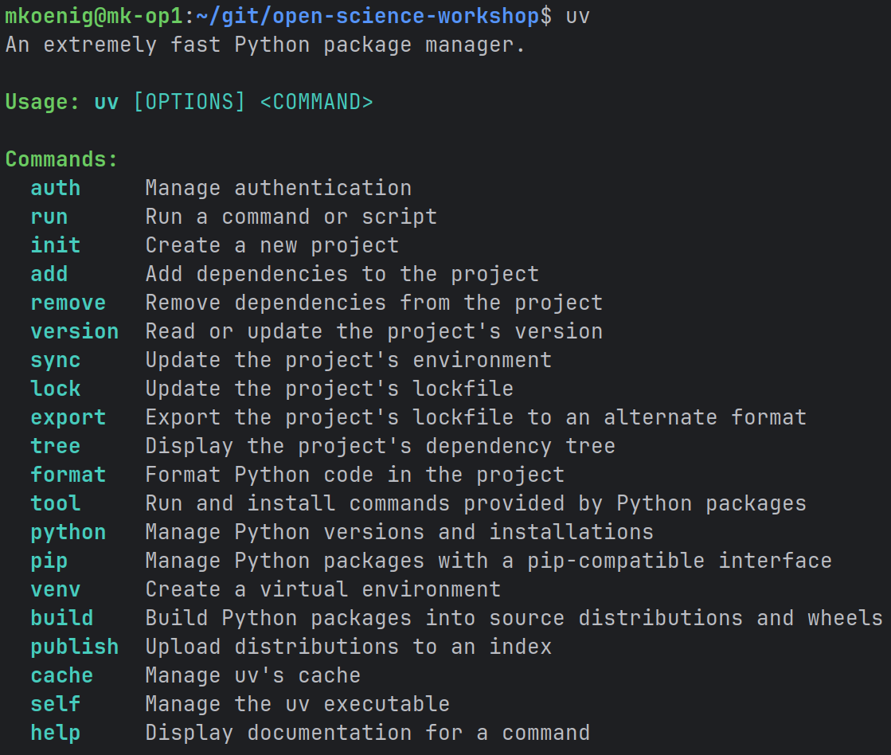

# uv {#sec-uv}

## What is **uv**?

**uv** is a next-generation Python package manager and virtual environment tool developed by **Astral** (creators of *Ruff*).
It aims to replace slow and fragmented Python tooling with a **single, fast, unified solution**.

At a glance, uv is:

* **Extremely fast**
  — built in Rust, 10–100× faster than pip/conda/poetry
* **A unified tool**
  — environments, dependency resolution, package management, execution — all in one
* **Fully compatible with the Python ecosystem**
  — pyproject.toml, PEP standards, pip-compatible commands
* **Drop-in replacement for many tools**
  — `pip`, `virtualenv`, `pipx`, dependency solvers, executors
* **Reliable & reproducible**
  — lockfiles ensure deterministic builds
* **Simple**
  — no environment activation needed for most tasks

uv removes a large part of Python’s traditional environment chaos and speeds up everything dramatically.




## Why uv?
Traditional Python workflows often suffer from:

* slow dependency resolution (pip, conda)
* conflicting tools (pip vs conda vs poetry)
* long environment creation times
* “it works on my machine” problems
* confusing activation steps
* slow startup of CLIs
* mixing system Python vs environments

**uv** aims to solve these by offering:

* a single consistent workflow
* extremely fast operations
* reproducible lockfiles
* caching to avoid redundant downloads
* compatibility with existing Python projects
* great developer ergonomics

uv is built to make the Python ecosystem feel modern, fast, and predictable.

## Install uv
Installation instructions are available here
[https://docs.astral.sh/uv/getting-started/installation/](https://docs.astral.sh/uv/getting-started/installation/).

To test the installation run 
```bash
uv
```
in your terminal.

{#fig-uv-commands width=40%}


## Clone the Workshop Repository
To demonstrate some of the functionality of uv we will use the workshop repository.
Use a git client such as [GitHub Desktop](https://desktop.github.com/download/) to get the latest code.

Or use the git client via the command line

```bash
git clone https://github.com/matthiaskoenig/open-science-workshop.git
cd open-science-workshop
```


## Synchronize Dependencies

Create a fully reproducible environment based on `pyproject.toml`:

```bash
uv sync
```

This installs the python interpreter and all dependencies.

### ❓ Explore

* How long did it take?
* Which folders did uv create? (`.venv/`, `uv.lock`)
* Does this replace `pip install -r requirements.txt`?


## Inspect the Environment

## 🔍 List installed packages

```bash
uv pip list
```

## 🔍 Show the dependency tree

```bash
uv tree
```

### ❓ Explore

* Which packages are direct dependencies?
* Which ones are transitive?


## Add, Remove, and Re-Add a Dependency

## 📌 A — Add a new package (example: `pandas`)

```bash
uv add pandas
```

Check:

```bash
uv pip list
uv tree
```

## 📌 B — Remove the package

```bash
uv remove pandas
```

Then verify:

```bash
uv pip list
uv tree
```

## 📌 C — Add it again (cached!)

```bash
uv add pandas
```

### ❓ Observations

* Was the second installation faster? Why?
* Did the lockfile and pyproject update correctly?


### Running Python Through uv

uv allows running commands in the environment **without activation**:

```bash
uv run python
```

For instance we can execute the `Hello World` script.

```bash
uv run src/osw/hello_world.py
```

In the `pyproject.toml` the script was registered and can be executed via
```bash
uv run hello_world
```

### ❓ Explore

* Does uv run inside the correct environment?
* How does this feel compared to activating the environment via `source .venv/bin/activate`?


## Further Reading

* Official site: [https://docs.astral.sh/uv/](https://docs.astral.sh/uv/)
* GitHub: [https://github.com/astral-sh/uv](https://github.com/astral-sh/uv)
* Ruff formatter/linter (same authors): [https://github.com/astral-sh/ruff](https://github.com/astral-sh/ruff) -->


## Slides
<iframe src="https://docs.google.com/presentation/d/e/2PACX-1vQVr2BOUlvLxxrlR8yBLkJ_S8q1ELey0DdJnaJAc0-gL1lYBFuF6nghgjAMMkSLKTONtIJDXrt6YxHN/pubembed?start=false&loop=false&delayms=3000" frameborder="0" width="480" height="299" allowfullscreen="true" mozallowfullscreen="true" webkitallowfullscreen="true"></iframe>
