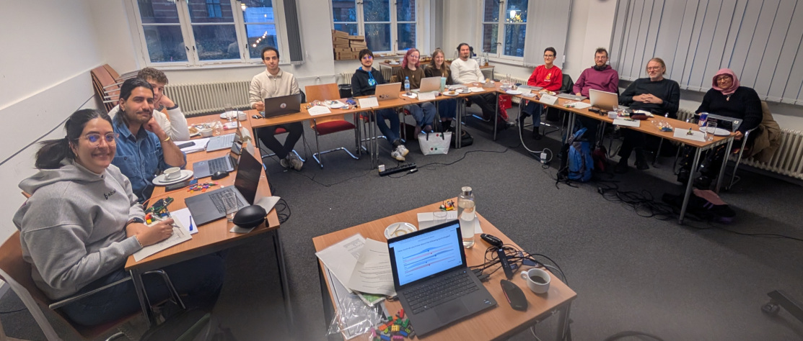
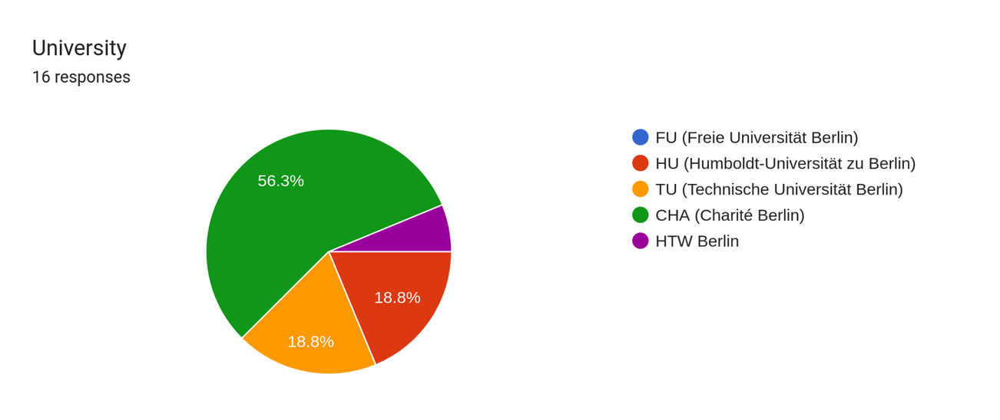
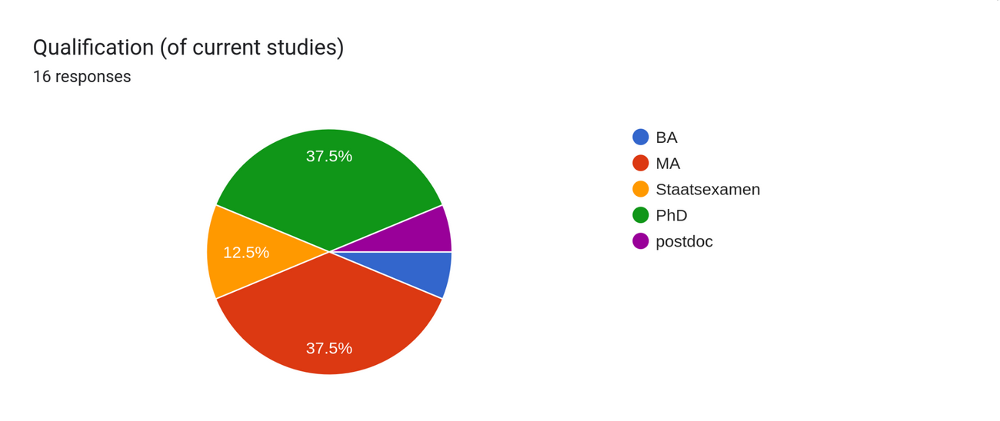
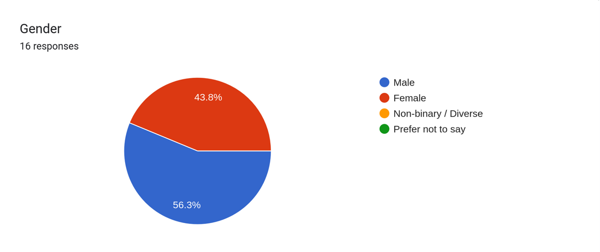
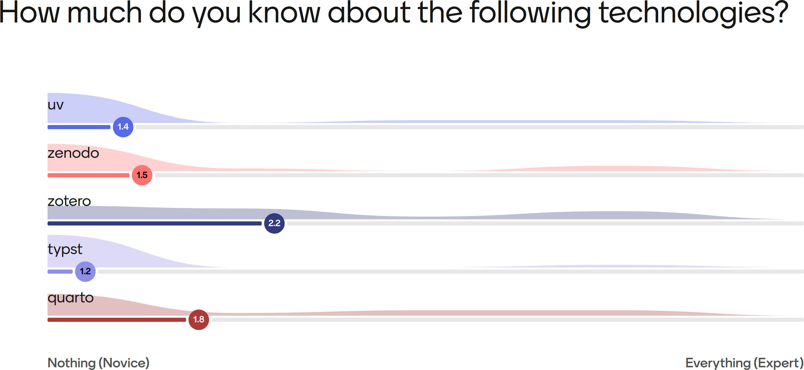
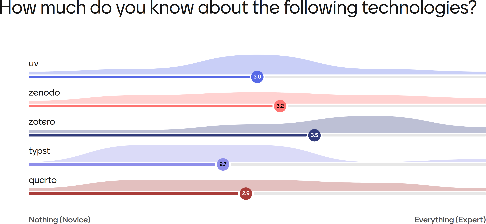
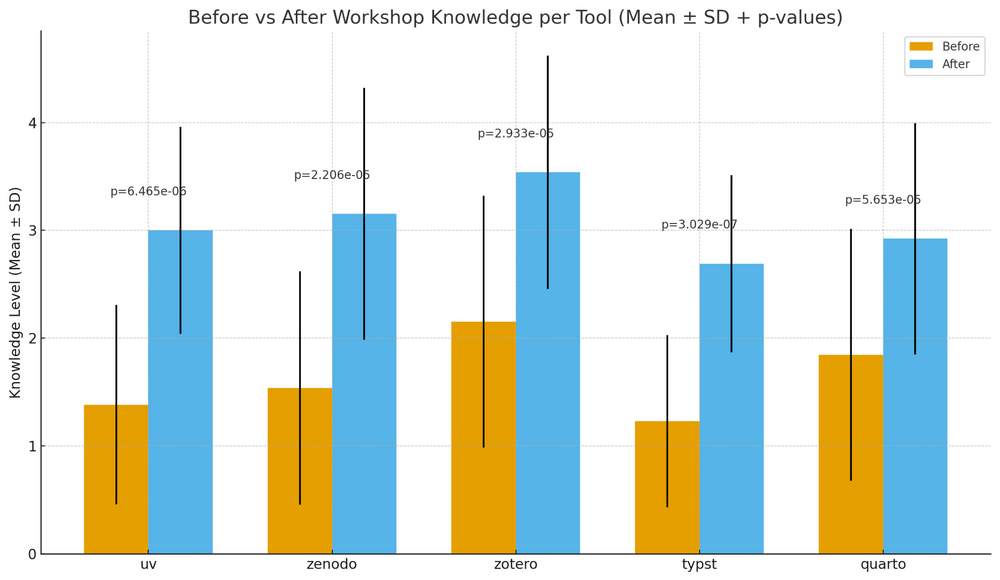

# Workshop 2025 {.unnumbered}

The Open Science Workshop on 28 November 2025 at Humboldt-Universität zu Berlin was a clear success. Building on the program outlined in the official flyer—which introduced participants to reproducible computational workflows, environment management, citable research objects, professional publishing tools, and open dissemination practices —the workshop fostered both technical skill-building and community engagement across the Berlin University Alliance (BUA).

## A Diverse and Engaged Participants

{#fig-participants width=70%}

A highlight of the workshop was the diversity of its participants. We brought together **students, PhD researchers, postdocs, and early-career scientists** from across:

* **Charité – Universitätsmedizin Berlin (CHA)**
* **Humboldt-Universität zu Berlin (HU)**
* **Technische Universität Berlin (TU)**
* **HTW Berlin**

{#fig-university width=80%}

Participants represented a wide range of disciplines, including computational proteomics, bioinformatics, chronobiology, molecular medicine, biophysics, geophysics, quantitative molecular biology, computational neuroscience, structural biology, and life science engineering.

{#fig-qualification width=80%}

Notably, the workshop attracted **many female participants** from varied scientific backgrounds. This diversity enriched group work, discussions, and the exchange of perspectives on reproducibility and open science.

{#fig-gender width=80%}

## Interactive and Practice-Oriented Learning

The program combined conceptual input with hands-on practice. The **LEGO® Serious Play®** session offered a creative, collaborative start, allowing participants to reflect on their experiences and challenges related to reproducibility.

Technical sessions then guided attendees through a modern open-science workflow:

* **Managing Python environments with uv**
* **Creating citable research outputs with Zenodo**
* **Reference management using Zotero**
* **Creating professional PDFs with Typst**
* **Publishing reproducible documents with Quarto**

These sessions, as presented in the program (page 2 of the flyer) , enabled participants not only to learn about open science principles but to apply them directly within their own research contexts.

## Learning Outcomes

A key outcome of the workshop was the **significant improvement in participants’ knowledge and confidence across all technologies presented**. Through hands-on exercises, guided demonstrations, and collaborative exploration, participants developed:

* A deeper understanding of reproducible computational workflows
* Practical skills in managing software environments and research assets
* Competence in producing and disseminating open, citable scientific outputs
* Awareness of best practices for sustainable and transparent research

**Before Workshop**

{#fig-gender width=80%}

**After Workshop**

{#fig-gender width=80%}

**Workshop Outcomes**

{#fig-gender width=80%}

This strengthened foundation will support participants in embedding reproducible methods within their ongoing and future research projects.

## Community Building and Open Discussion

The day closed with an open discussion and networking session, where participants exchanged ideas and explored opportunities for collaboration. Many expressed strong interest in future training on reproducible workflows, FAIR data, and open dissemination—an encouraging sign for strengthening open science practices across the BUA.

## Outlook

The workshop demonstrated that interest in open, transparent, and reproducible computational workflows is both high and growing. It successfully equipped participants with practical tools, fostered interdisciplinary exchange, and contributed to building a more connected and inclusive open-science community in Berlin.

## Slides
<iframe src="https://docs.google.com/presentation/d/e/2PACX-1vTdt3w3p2zTAs4egB508F8r-jqYgHnMqXsJtPU3zxvILWmCzDovQfDvt4uBfJEmYI-y0FY42WtaARRX/pubembed?start=false&loop=false&delayms=3000" frameborder="0" width="480" height="299" allowfullscreen="true" mozallowfullscreen="true" webkitallowfullscreen="true"></iframe>