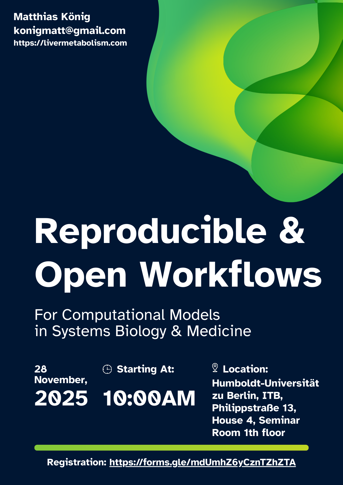
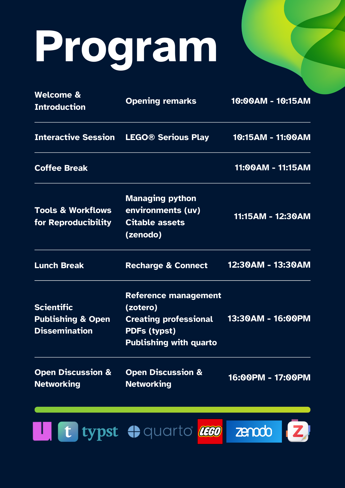

# Overview {.unnumbered}

## Introduction & Motivation

Reproducibility is a cornerstone of modern computational research — yet many everyday workflows in data science, systems biology, and computational modeling remain fragile, siloed, or dependent on personal conventions. Researchers frequently encounter challenges such as:

* inconsistent Python environments
* missing metadata or unclear provenance
* scattered reference collections
* non-reproducible documents or analysis pipelines
* difficulty sharing results in open and citable formats

This workshop addresses these challenges by providing **a practical, hands-on introduction** to tools that make computational research **open, transparent, and verifiably reproducible**.

The workshop is made possible through support from the **Open Science Ambassador Program at the Berlin University Alliance (BUA)**, which aims to empower researchers to adopt open, FAIR, and reproducible practices across all phases of the research lifecycle.

## 🎯 Workshop Goals

By the end of the day, participants will:

* understand core principles of **open science and reproducible workflows**
* learn to manage **Python environments** reliably using **uv**
* create **citable research assets** using **Zenodo**
* organize and maintain **structured reference libraries** with **Zotero**
* produce **professional, reproducible documents** using **Typst**
* publish **integrated analyses** and reports using **Quarto**
* reflect on their own workflow practices through **LEGO® Serious Play**
* gain confidence to integrate open tools into their daily research

## 🧰 Tools Covered in the Course

::: {.callout-tip}
## Tip: Customize Your Learning Path

The course does not have to be done linearly—you can explore the content in any order. Choose the learning path that best suits your goals, interests, or current knowledge level. This way, you stay engaged and make the most of your learning experience.
:::

- **uv — Reliable Python Environment Management** (@sec-uv)
  A fast, modern tool for Python environments and package management, enabling reproducible computational modelling across machines and teams.
- **Zenodo — Citable Research Outputs** (@sec-zenodo)
  A platform for sharing datasets, code, models, and workflows with persistent DOIs. Essential for transparency, credit, and long-term accessibility.
- **Zotero — Reference & Knowledge Management** (@sec-zotero)
  Open-source reference management for organizing literature, annotations, and citations across projects.
- **Typst — Modern Document Preparation** (@sec-typst)
  A next-generation typesetting system designed for scientific writing: fast, reproducible, expressive, and accessible.
- **Quarto — Reproducible Publishing** (@sec-quarto)
  A unified toolchain for scientific and technical publishing, enabling dynamic reports, manuscripts, slides, and websites.

## Program
**Reproducible & Open Workflows for Computational Models**  
Humboldt-Universität zu Berlin — 28 November 2025, 10:00–17:00  
Funded by the BUA Open Science Ambassador Program

{#fig-flyer1 width=40%}
{#fig-flyer2 width=40%}

::: {.callout-note}
## Note: Help us improve the workshop

This course is a work in progress, and we’re always looking for ways to make it better. If you have suggestions, ideas, or feedback on what to improve or how to enhance your learning experience, please don’t hesitate to get in touch. Your input is valuable and appreciated!
:::